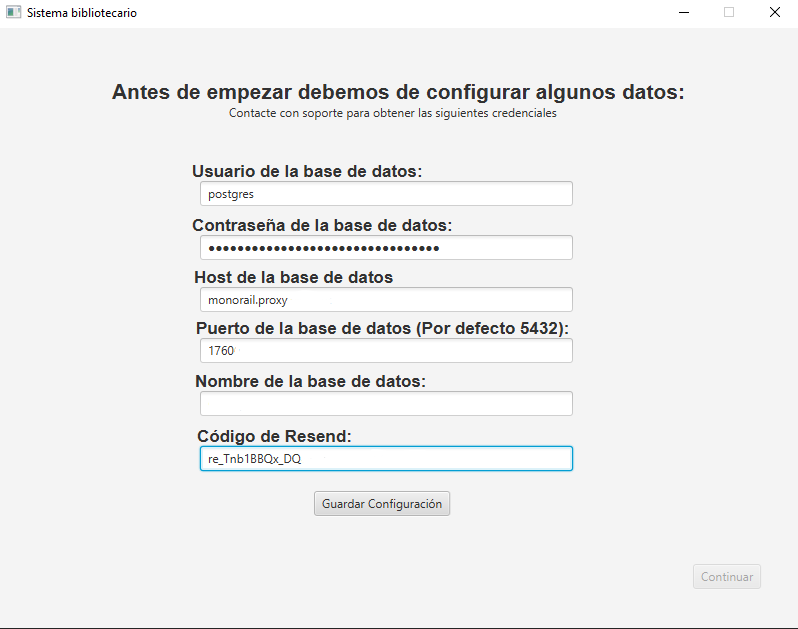
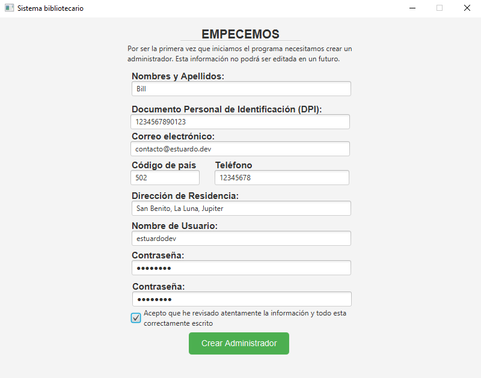

# Sistema bibliotecario

> Este es un sistema de votación simple para fines educativos de la Universidad Mariano Gálvez de Guatemala.
>
> Este sistema cumple con varias características requeridas por el catedrático como proyecto del curso de algorimos.
>
> Puedes explorar el manual técnico y de usuario que se encuentra en el directorio Manuales del proyecto.

Sistema Bibliotecario, es un sistema simple que sirve para gestionar libros, autores y editoriales de manera rápida y efectiva, haciendo uso de base de datos e interfáz gráfica.

Todos los nuevos registros pueden ser gestionados por el administrador, mientras tanto, los usuarios pueden realizar prestamos de libros si en dado caso está en stock.

**ESTE PROYECTO ES CON FINES EDUCATIVOS Y POR NINGÚN MOTIVO DEBE DE SER USADO EN UN ÁMBITO PROFESIONAL POR SEGURIDAD.**

## ¿Cómo utilizar?

para utilizar este proyecto puedes seguir las siguientes indicaciones:

### Paso 1

Descargar la última versión del archivo jar, lo puedes realizar en los siguientes enlaces:

- [Releases GitHub](https://github.com/estuardodev/ProyectoProgramacion/releases)

> Posiblemente aparezca una advertencia de tu navegador por tratarse de un archivo ".jar" como tal, el ejecutable es totalmente seguro.

### Paso 2

Intuyendo que ya tienes descargado e instalado Java 17 o superior, ejecutas el ".jar" que se te ha descargado.

### Paso 3

Solicitar los datos de base de datos y de resend a tu administrador o encargado de sistemas y rellenar dichos datos en lo que se te solicita en el programa.

***NO COMPARTIR ESTOS DATOS CON NADIE***

### Paso 4

LLenar el formulario para la creación de un nuevo administrador el cual será el encargado de crear los registros correspondientes.

***NO COMPARTIR TU CONTRASEÑA CON NADIE***

### LISTO

Ya puedes acceder al sistema sin preocupación alguna y comenzar a realizar los registros que necesites.

## Tecnologías o Dependencias utilizadas

- [Java](https://www.oracle.com/java/technologies/downloads/#jdk21-windows)
- [JavaFx](https://openjfx.io/)
- [Posgresql](https://jdbc.postgresql.org/)
- [Resend](https://resend.com/docs/send-with-java)
- [Gson](https://mvnrepository.com/artifact/com.google.code.gson/gson)
